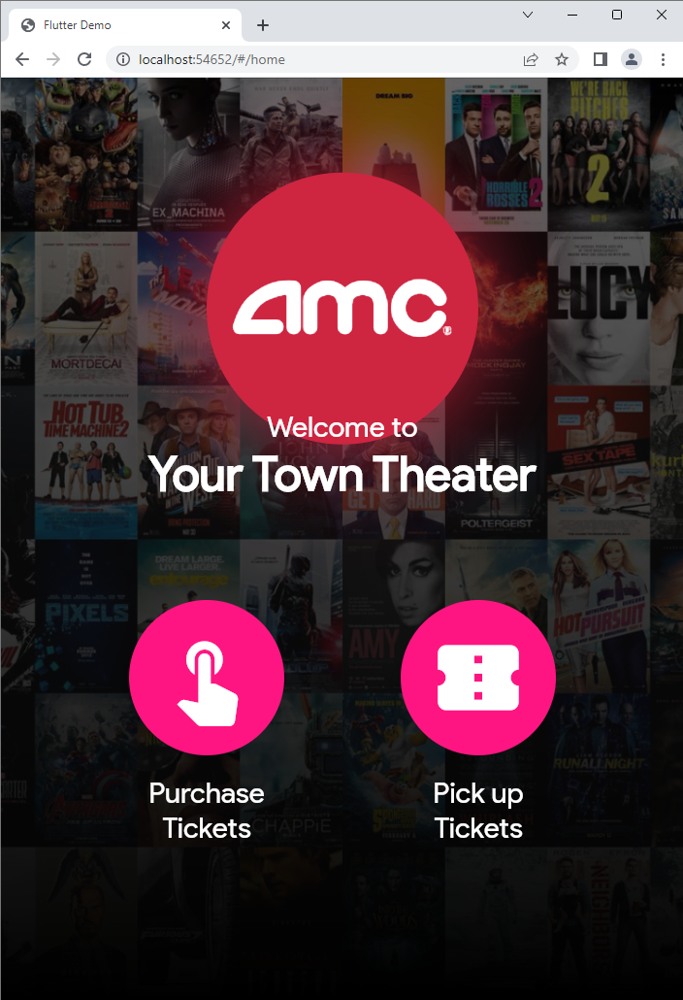
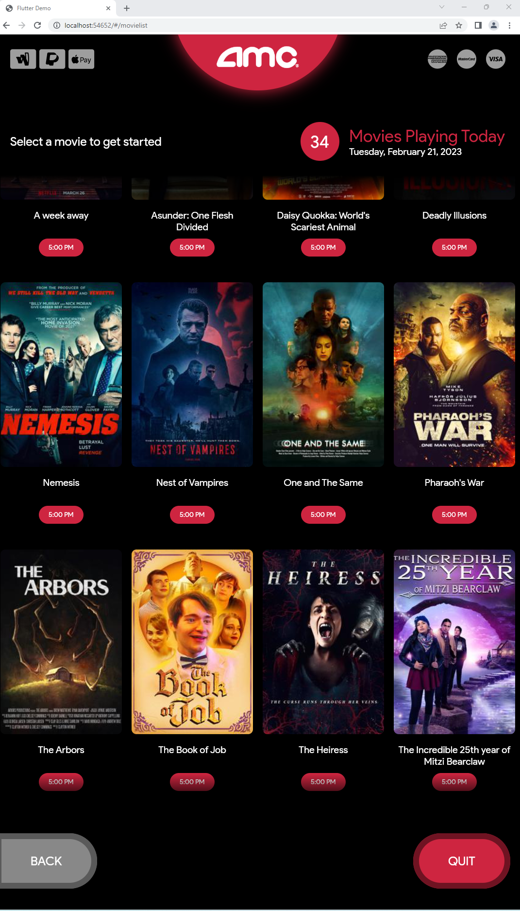
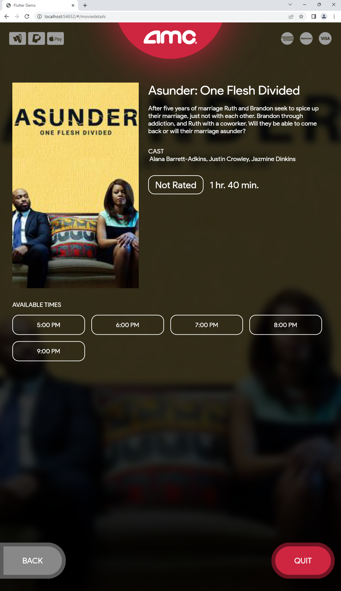
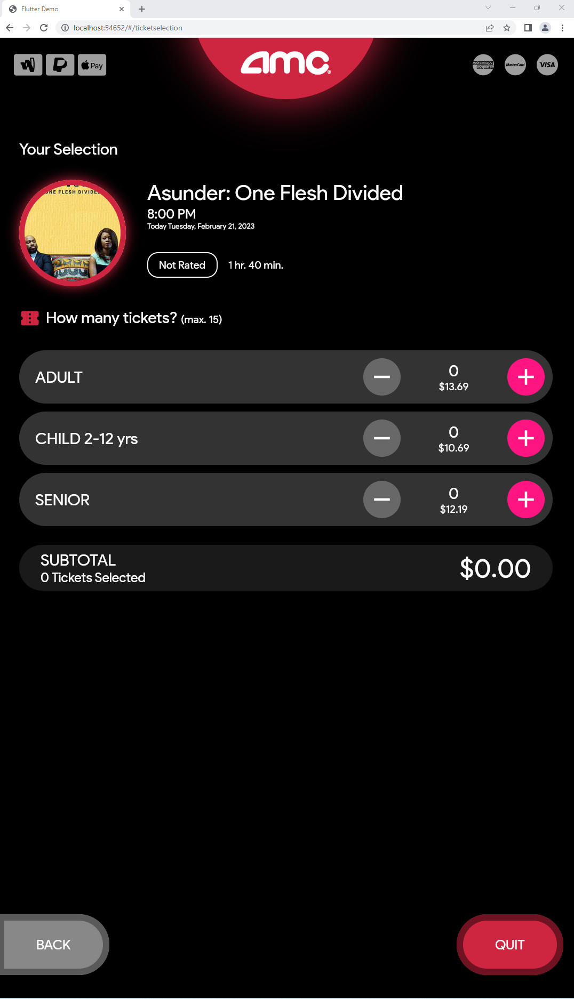
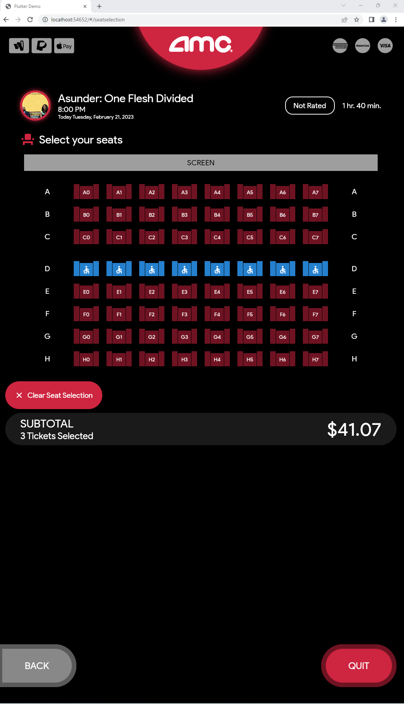
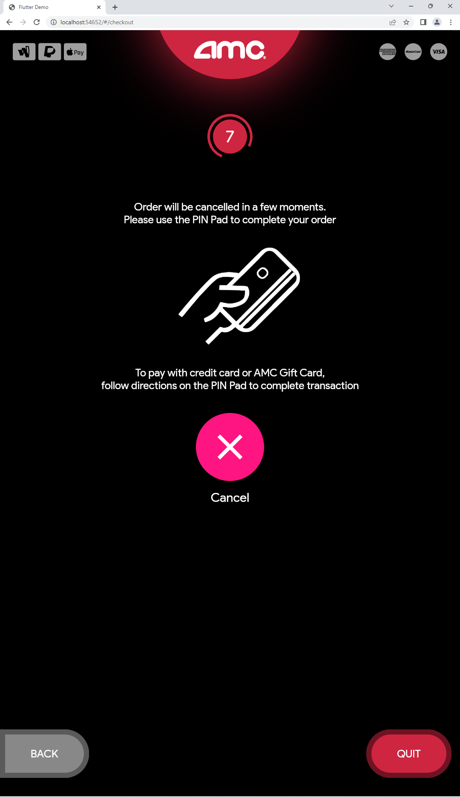

# AMC Movie Ticketing Kiosk Experience Recreated in Flutter

In this Flutter Recreate Series, I demonstrate the workflow on how I recreated the AMC Movie Ticketing Kiosk Experience in Flutter, from sketching, prototyping, to the coding of the application. I wrap it up by demoing it on a deployed device exactly how I would envision it being running. Then I give an in-depth code walkthrough of the whole application, starting from demoing the completed app, then followed up by how I structured the app, and giving insights on why I created the widgets they way I did and approaches taken on the distribution of its components (services, pages, widgets, etc.).

### ScreenShot

 

  
   
  
  
  
  
  
  
  
  

